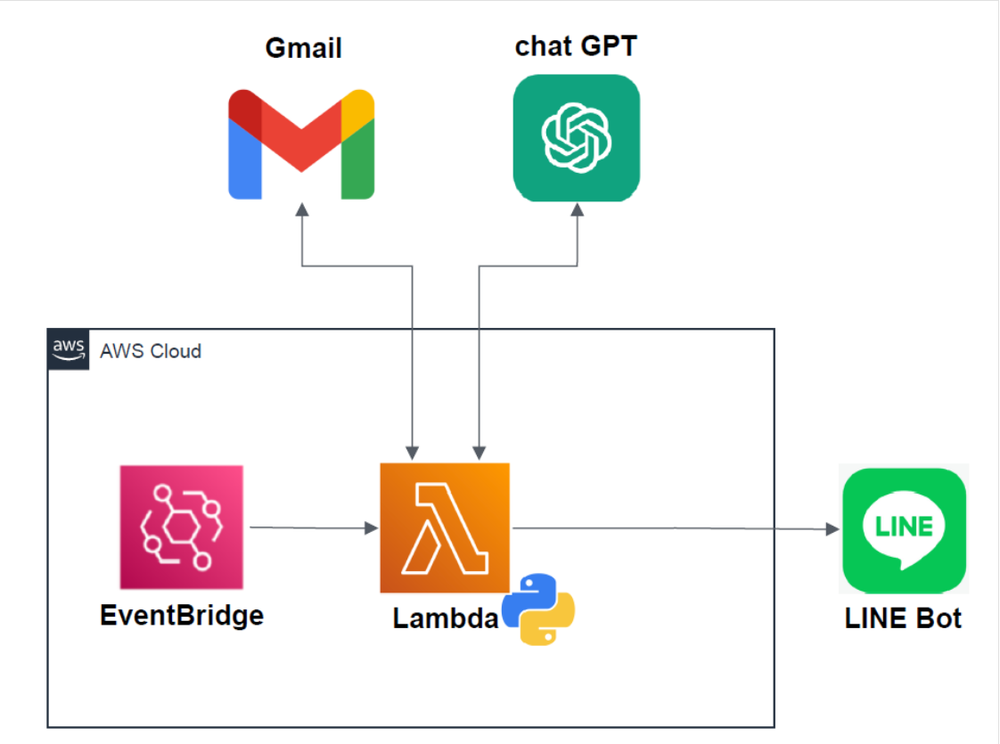

# Gmail Summary Stack
以下の処理を行うStackを構築
1. Gmail APIを用いて、Gmailの本文を取得
2. 取得内容についてchatGPTで要約
3. 要約した内容をLINE Botで通知

### 構成図

### フォルダ構成
- lambda：処理を行うスクリプトファイル、requirements.txt、認証関連のファイル（値については、各自で設定してください。）
- layer：処理で使用する外部ライブラリのモジュールを配置
- lib：AWSでLambda,Lambda Layer,EventBridgeを構築するための定義ファイル